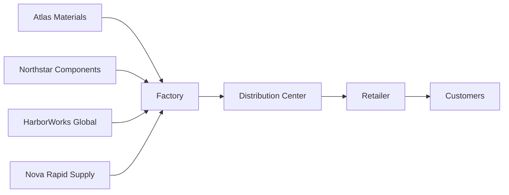

# Supply-Chain Management Game

An interactive educational strategy game about managing an end-to-end supply chain. Players balance supplier sourcing, production, inventory, transportation, pricing, customer demand, and operational risk across a six-month campaign.

**Play the deployed game:** [scm.npaing.com](https://scm.npaing.com)

The game is designed to make cause and effect visible: raw materials take time to arrive, factories convert them into finished goods, inventory moves through distribution and retail, and upstream decisions eventually affect customers.

## Gameplay

Each chapter represents one calendar month with 30 daily turns. During each turn, the player reviews the live network, adjusts the available planning controls, and advances the simulation by one day.

The core decisions include:

- Choosing an operating strategy: low cost, balanced, or high service
- Setting total purchasing and production quantities
- Allocating orders across suppliers
- Adjusting the retail selling price
- Selecting transportation modes
- Managing overtime and inventory buffers
- Controlling finished-goods releases between facilities

Controls are introduced progressively so early chapters remain approachable.

## Campaign

| Chapter | Month | Focus |
| --- | --- | --- |
| 1 | January — Foundations | Raw materials, finished goods, production, and inventory flow |
| 2 | February — Supplier Mix | Supplier allocation, cost, reliability, quality, and lead time |
| 3 | March — Market Pricing | Price elasticity, demand forecasting, revenue, and margin |
| 4 | April — Port Pressure | Transportation choices, route exposure, and shipment delays |
| 5 | May — Peak Season | Seasonality, weekend capacity, inventory buffers, and overtime |
| 6 | June — Resilient Network | Full-system planning under multiple sources of uncertainty |

## Supply-Chain Network



The live network can be panned and zoomed with the mouse. Individual suppliers and facilities can also be repositioned while playing.

Facility cards distinguish between:

- Supplier capacity and order allocation
- Factory raw-material inventory
- Factory finished-goods inventory
- Inbound shipments
- Distribution and retail inventory
- Customer demand, fulfillment, backlog, and lost sales

## Simulation Features

### Supplier tradeoffs

Four suppliers have different costs, capacities, reliability rates, quality yields, lead times, and transportation routes. Orders can be divided between them to balance efficiency and resilience.

### Price-sensitive demand

Players set the retail price between `$100` and `$190`. Demand responds according to price elasticity, seasonality, weekday effects, known promotions, and deterministic variation. Backlogged customer orders retain the selling price from the day they were created.

### Calendar effects

Every chapter contains 30 calendar days. Customer demand and shipments continue during weekends, while supplier and regular production capacity fall to 60%.

### Disruptions and risk signals

Operational disruptions are not announced with exact dates in advance. The game may provide uncertain risk signals, but timing, duration, and severity remain unknown until an event occurs.

Possible events include:

- Supplier capacity interruptions
- Supplier quality problems
- Port congestion and terminal closures
- Factory equipment failures
- Unexpected demand surges

Port disruptions can delay shipments already in transit as well as new departures on affected routes.

### Scoring and debrief

Each completed month receives a score based on:

- Customer service
- Operating profit
- Resilience during disruptions
- Inventory efficiency

The final report reveals the event timeline and highlights the decisions that most affected the outcome.

## Technology

- [React](https://react.dev/) and TypeScript
- [Vite](https://vite.dev/) for development and production builds
- [React Flow](https://reactflow.dev/) for the interactive supply-chain network
- [Zustand](https://zustand-demo.pmnd.rs/) for game and progression state
- [Recharts](https://recharts.org/) for performance charts
- [Vitest](https://vitest.dev/) and Testing Library for automated tests
- CSS with responsive design tokens and reduced-motion support

The game runs entirely in the browser. Progress, unlocked chapters, and best scores are stored locally without accounts or a backend.

## Getting Started

### Requirements

- Node.js 20.19 or newer
- npm

### Installation

```bash
git clone https://github.com/ShinKhantPaing772/supply-chain-game.git
cd supply-chain-game
npm install
npm run dev
```

Open the local URL printed by Vite in your browser.

## Available Scripts

| Command | Description |
| --- | --- |
| `npm run dev` | Start the Vite development server |
| `npm run build` | Type-check and create a production build |
| `npm run preview` | Preview the production build locally |
| `npm test` | Run the automated test suite once |
| `npm run test:watch` | Run tests in watch mode |

## Project Structure

```text
src/
├── components/       UI, planning controls, charts, and network visualization
├── game/             Simulation engine, scenarios, types, and engine tests
├── store/            Browser persistence and campaign progression
├── App.tsx           Main campaign, gameplay, and debrief screens
└── styles.css        Responsive visual system
```

The simulation engine is kept independent from React. Its public operations—including `createGame`, `applyDecision`, `advanceDay`, `calculateKpis`, and `calculateScore`—are pure TypeScript functions that can be tested without rendering the interface.

## Testing

The automated tests cover important simulation rules such as:

- Material and finished-goods inventory separation
- Split supplier orders and individual lead times
- Supplier quality yield and weekend capacity
- Price elasticity and demand projections
- Backlog price preservation
- In-transit port delays
- Hidden disruption information
- KPI and scoring calculations

Run the complete test suite with:

```bash
npm test
```

## Repository

[github.com/ShinKhantPaing772/supply-chain-game](https://github.com/ShinKhantPaing772/supply-chain-game)
